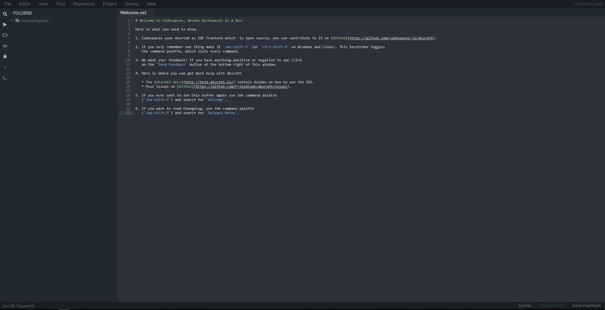

# How to Install and Use Akurath on Ubuntu 16.04

## Introduction

###  Akurath

> "Open source devops IDE on cloud, a Frontend engine used in Codespaces"

Akurath is a complete and modular cloud IDE.


Akurath is built with web technologies: `node.js`, `javascript`, `html` and `less`. The IDE possesses a very modular and extensible architecture, that allows you to build your own features with through add-ons. Akurath is the first open and modular IDE capable of running both on the Desktop and in the cloud (with offline support).

## Prerequisites

To follow this tutorial, you will need the following:
* 64-bit Ubuntu 14.04
* Non-root user with sudo privileges

All the commands in this tutorial should be run as a non-root user. Priviliged commands are preceded by sudo.

## Step 1 - Install NVM

Akurath is based on Node.js and Javascript. It requires specific version(0.16.1) of NVM to be installed. This section shows you just that.

Let us update the package database first.

```
sudo apt-get update
```

After updating the package database, Install the dependencies of NVM.

```
sudo apt-get install build-essential libssl-dev git python  -yq
```

Now let's install NVM:

```
curl https://raw.githubusercontent.com/creationix/nvm/v0.16.1/install.sh | sh
```

## Step 2 - Install Node JS

Source the profile configurations.

```
source ~/.profile
```
Now let's install Node.

```
nvm install v0.10.40
```

Use Node 0.10.40.

```
nvm use v0.10.40
```

Update Bashrc file to use Node 0.10.40.

```
echo "nvm use v0.10.40" >> ~/.bashrc
```

## Step 3 - Install Akurath

 Now we are going to install the latest and greatest version of Akurath. This can be done by two ways.
 * Install from source
 * Install from npm

### Step 3.1 - Install From Source

First, we have to clone the Akurath repository.

```
git clone https://gitlab.com/codespaces/akurath.git
```

After that, we need to install Grunt. Grunt is basically a Javascript Task runner. You can fine more information about Grunt on [this link](https://www.npmjs.com/package/grunt).

```
npm install grunt -g
```

Change directory into Akurath and Install Akurath dependencies.

```
cd akurath
npm install grunt-exec grunt-contrib-compress grunt-contrib-compress grunt-contrib-compress
```

You may some dependency errors like . Ignore those error since it won't affect the operation of Akurath.

```
npm ERR! peerinvalid The package grunt does not satisfy its siblings' peerDependencies requirements!
npm ERR! peerinvalid Peer grunt-exec@1.0.1 wants grunt@>=0.4
npm ERR! peerinvalid Peer grunt-contrib-clean@1.0.0 wants grunt@>= 0.4.5

npm ERR! System Linux 4.4.0-43-generic
npm ERR! command "/home/ubuntu/.nvm/v0.10.40/bin/node" "/home/ubuntu/.nvm/v0.10.40/bin/npm" "install" "grunt-exec" "grunt-contrib-compress" "grunt-contrib-compress" "grunt-contrib-compress"
npm ERR! cwd /home/ubuntu/akurath
npm ERR! node -v v0.10.40
npm ERR! npm -v 1.4.28
npm ERR! code EPEERINVALID
npm ERR!
npm ERR! Additional logging details can be found in:
npm ERR!     /home/ubuntu/akurath/npm-debug.log
npm ERR! not ok code 0
```

### Step 3.2 - Install from NPM

Akurath is available as a NPM package. You can install this package just like any other npm package.

```
npm install -g akurath
```

## Step 4 - Run Akurath IDE

That's it. We are all set to run Akurath.
If you have installed Akurath from source, then simply run grunt from the Akurath directory to start the Akurath IDE.

```
grunt
```
If you have installed Akurath as a NPM package, then to start Akurath IDE,

```
akurath run ./myworkspace --open
```

After running grunt, you will see that Akurath is running on localhost with port 8000.

```
Akurath is running at http://localhost:8000
```

Akurath console is accessible on your machine's IP with port 8000. Just visit the IP on your browser to see Akurath in action.


Enter your e-mail and you are ready to use Akurath IDE!


